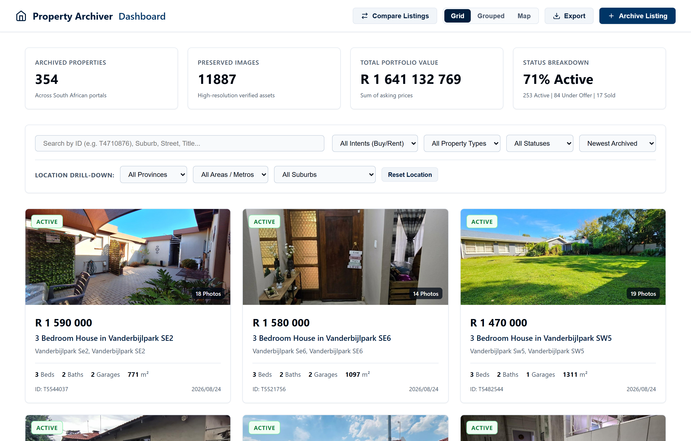
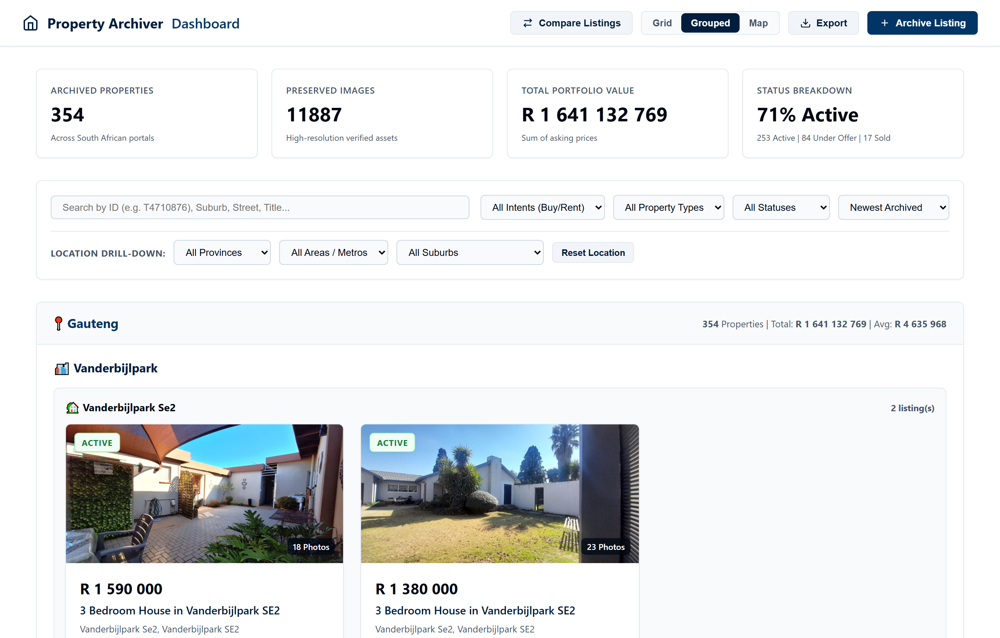
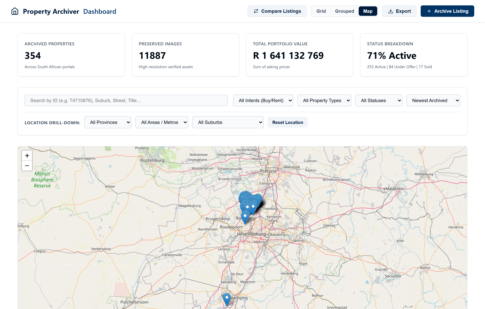
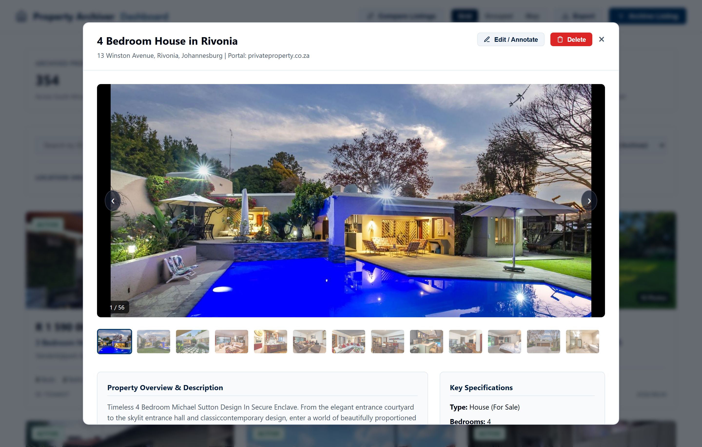

# Property Archiver

[](https://www.python.org/downloads/)
[](https://opensource.org/licenses/MIT)
[](docs/architecture.md)

A high-performance, modular system for downloading, validating, organizing, and analyzing South African real estate property listings and market data.

Built with **Pydantic v2**, **HTTPX**, **Playwright**, and a **Zero-Build ES6 Web Dashboard**, Property Archiver preserves complete byte-exact raw HTML snapshots, high-resolution media galleries, multi-agent contact records, municipal rates, taxes, body corporate levies, and historical change diffs in a **tiered geographic filesystem hierarchy**.

---

## UI Showcase & Web Dashboard

Launch the embedded dashboard anytime with `property-archiver serve`.

### 1. Portfolio Grid View & Cascading Filters
Responsive property cards with live status badges, star ratings, custom user tags, pricing, and specs alongside portfolio metrics.


### 2. Regional Hierarchy & Grouped View
Collapsible South African regional tree (**Province $\rightarrow$ Area / Metro $\rightarrow$ Suburb**) displaying aggregate listing counts, total property values, and average prices per area.


### 3. Interactive GIS Map View
Geospatial visualization plotting GPS pins across South Africa with interactive property dossier popups.


### 4. Property Dossier, Full Gallery & Annotations
In-depth property dossier featuring high-resolution photo carousel, specifications, rates & taxes breakdown, coordinates mini-map, manual lifecycle edit drawer, and archive delete controls.


---

## Core Capabilities

- **Tiered South African Geographic Hierarchy**: Automatically structures archives on disk by regional hierarchy (`archive/listings/<province>/<area>/<suburb>/<listing_id>/`).
- **Property Classification & Transaction Intent**: First-class support for transaction types (**For Sale / Buy** vs **To Rent**) and property categories (**House**, **Apartment**, **Townhouse**, **Vacant Land**, **Commercial**, **Farm**).
- **Smart Image Caching & Deduplication**: Avoids re-downloading identical photos over the network when updating or re-archiving existing properties (<1s re-scraping).
- **Edit & Annotations Engine**: Assign custom private notes, comma-separated tags (`["Shortlisted", "Prime", "High ROI"]`), 1–5 star ratings, and manual lifecycle overrides (`active`, `under_offer`, `sold`).
- **Cryptographic Manifests**: Every archive is validated with SHA-256 digests (`checksums.json`).
- **Historical Change Detection**: Generates structured diffs (`history.json`) tracking price changes, status changes, and manual edits over time.
- **Multi-Format Export**: Export filtered subsets or complete portfolios to **CSV**, **Relational SQLite (`portfolio.db`)**, **GeoJSON**, and **JSONL**.

---

## Quick Start

### Installation

```bash
# Clone the repository
git clone https://github.com/ENM032/ArchivedProperty.git
cd ArchivedProperty

# Install dependencies in editable mode
pip install -e .
```

---

## CLI Command Reference

```bash
# 1. Fetch and archive a property listing (URL or Portal ID)
property-archiver fetch https://www.privateproperty.co.za/for-sale/gauteng/sandton/rivonia/4-bedroom-house-in-rivonia/T4710876
property-archiver fetch T4710876

# 2. Launch the interactive Web Dashboard
property-archiver serve --port 8000

# 3. Explore the terminal regional hierarchy tree
property-archiver tree

# 4. Edit status, notes, tags, or rating
property-archiver edit T4710876 --status=under_offer --notes="Offer submitted" --tags="Prime, Shortlisted" --rating=5

# 5. Delete an archived property
property-archiver delete T4710876 --yes

# 6. Reorganize flat legacy archives into tiered hierarchy
property-archiver reorganize

# 7. Regional multi-format export
property-archiver export --format=csv --suburb="Rivonia" --output="rivonia.csv"
property-archiver export --format=sqlite --output="portfolio.db"
property-archiver export --format=geojson --output="properties.geojson"
```

---

## Documentation

- [System Architecture](docs/architecture.md)
- [Web Dashboard User Guide](docs/dashboard_guide.md)
- [Canonical Data Schema (v1.0.0)](docs/data_schema.md)
- [CLI User Guide](docs/cli_user_guide.md)
- [Geographic Hierarchy Guide](docs/hierarchy_guide.md)
- [Export & GIS Guide](docs/export_and_gis_guide.md)
- [Security & Compliance](docs/security_and_compliance.md)

---

## License

MIT License. See [LICENSE](LICENSE) for details.
